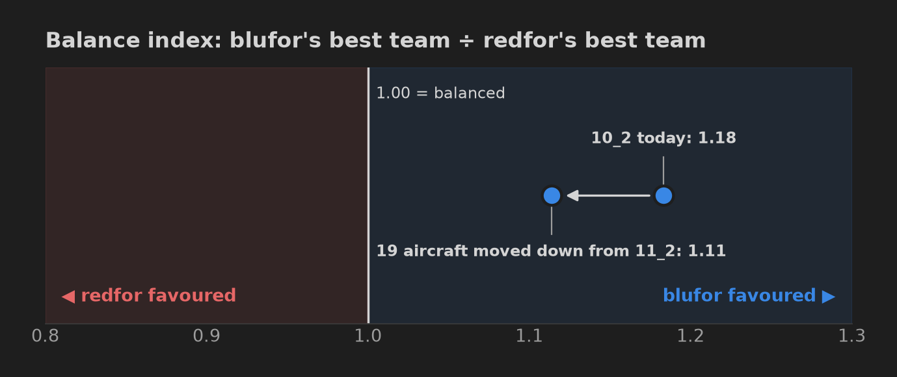
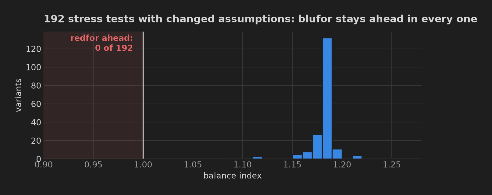
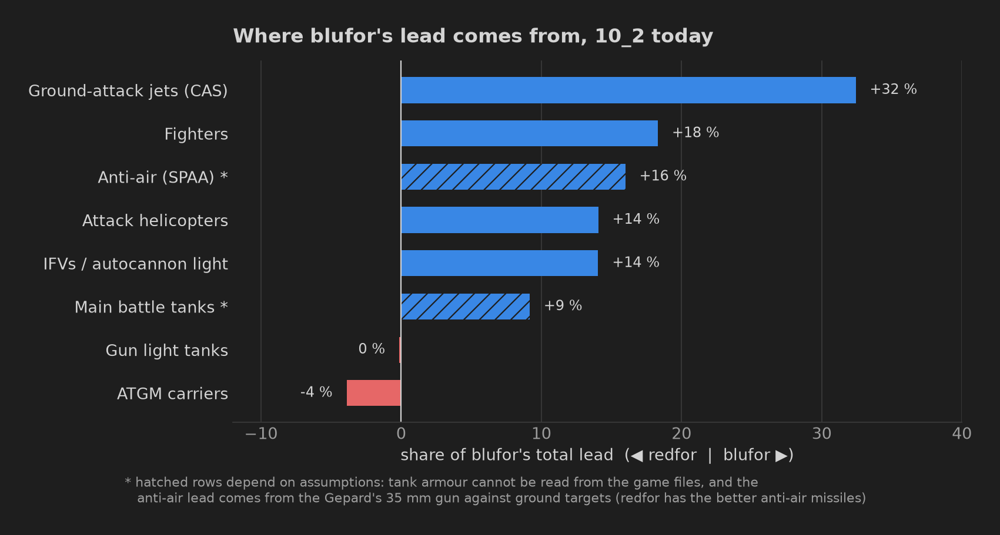
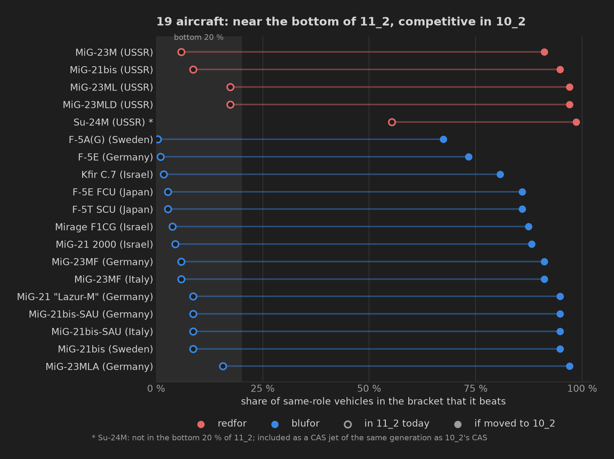
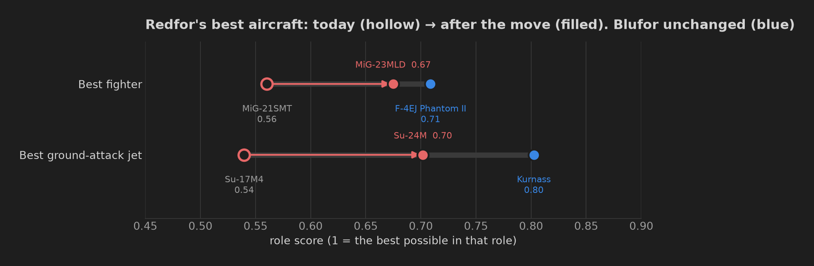
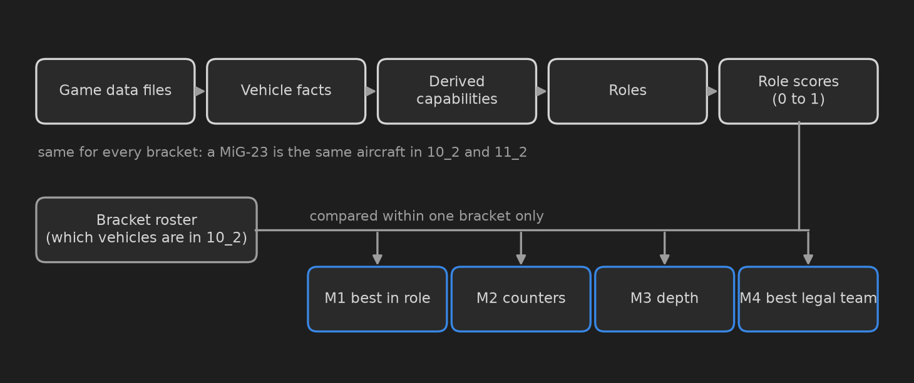

# Ground Sim 10_2 is biased toward blufor, and part of the fix is sitting in 11_2

**Short answer**

- **The 10_2 bracket of Ground Simulator Battles is biased toward blufor**, and the bias is in
  the air.
- **Redfor's missing aircraft already exist in the game.** MiG-23s and the MiG-21bis sit in 11_2,
  where they are among the weakest aircraft in the bracket, and the Su-24M is a mid-pack ground-attack jet
  there.
- **Moving them (and 14 blufor aircraft of the same era) down to 10_2 shrinks blufor's advantage
  by almost 40 %.**

**How to read this number.** For each side, I built the strongest team it can legally put on the
field and scored it (section 5 explains how). The **balance index** is blufor's team score divided
by redfor's:

| balance index | meaning |
|---|---|
| **1.00** | perfectly balanced: both sides can field equally strong teams |
| **above 1.00** | blufor favoured. 1.18 means blufor's best team is **18 % stronger** than redfor's |
| **below 1.00** | redfor favoured. 0.85 would mean blufor's best team is 15 % weaker than redfor's |

**10_2 today scores 1.18.** Moving 19 misplaced aircraft down from 11_2 brings it to **1.11**.

Game version 2.59.0.33, analysed in September 2026. Brackets are reshuffled from time to time, so
check the current lists before acting on this. Everything is computed from the game's own data files, and every number can
be rebuilt from the rules in this document.

---

## Contents

1. [Summary](#1-summary)
2. [Background: how Ground Sim matchmaking works](#2-background-how-ground-sim-matchmaking-works)
3. [The question, and why "best vehicle vs best vehicle" is not enough](#3-the-question)
4. [The data](#4-the-data)
5. [Building blocks: from raw files to a team score](#5-building-blocks-from-raw-files-to-a-team-score)
6. [Results: 10_2 as it is today](#6-results-10_2-as-it-is-today)
7. [Vehicles that sit in the wrong bracket](#7-vehicles-that-sit-in-the-wrong-bracket)
8. [Does the answer survive different assumptions?](#8-does-the-answer-survive-different-assumptions)
9. [Limitations](#9-limitations)
10. [Recommendations](#10-recommendations)
11. [How to check this yourself](#11-how-to-check-this-yourself)
12. Appendices: every rule, weight and parameter
    - [A: role eligibility rules](#appendix-a-role-eligibility-rules)
    - [B: role scores](#appendix-b-role-scores-every-feature-weight-and-curve)
    - [C: team model parameters](#appendix-c-team-model-parameters)
    - [D: hero team lineups](#appendix-d-hero-team-lineups-10_2-today)
    - [E: glossary](#appendix-e-glossary)

**How to read this document.**
- **If you play the game and want the point:** section 1 is enough.
- **If you want to know how it works:** sections 2–8.
- **If you want to check or challenge it:** sections 9, 11 and the appendices.

Unfamiliar terms (SPAA, IFV, ATGM, CAS and so on) are explained where they first appear, and all
of them are in the [glossary](#appendix-e-glossary).

---

## 1. Summary

### Finding 1: 10_2 is biased toward blufor, and it is not close

Blufor's strongest possible team is **18 % stronger** than redfor's (balance index **1.18**).
This is not a fragile result. I re-ran the whole analysis 192 times, each time changing one
assumption: the team mix, how much each vehicle type matters, and every single scoring weight.
I also removed each blufor nation in turn. **Blufor came out ahead every time**, with an index
from 1.11 to 1.24.

### Finding 2: the advantage is in the air

Almost two-thirds (64 %) of blufor's lead comes from three kinds of aircraft:
- ground-attack jets (close air support, "CAS" from here on);
- fighters;
- attack helicopters.

In each of these roles, blufor's best aircraft is clearly better:

| role | blufor's best | redfor's best |
|---|---|---|
| CAS | F-4E / Kurnass: 6 Maverick missiles, radar, radar-guided air-to-air missiles | Su-17M4: 4 guided weapons, infrared air-to-air missiles only |
| fighter | F-4E family: radar missiles reaching 50 km | MiG-21SMT: missiles reaching 15 km, turns worse |
| attack helicopter | T129: 16 anti-tank missiles to 10 km, 8 Stingers, missile warner | Z-9WA: 8 missiles to 6 km |

On the ground it is closer:
- Blufor leads with infantry fighting vehicles (IFVs: light armoured vehicles with autocannons),
  and slightly with tanks.
- Redfor leads with anti-tank-missile carriers (ATGM carriers, e.g. Khrizantema-S).
- Gun-armed light tanks are even.

The anti-aircraft bar (SPAA: self-propelled anti-aircraft) needs care. Redfor actually has the
better anti-air missile systems. Blufor's lead there comes from the Gepard 1A2's 35 mm gun, which
is also deadly against light ground vehicles. That result, like the tank one, depends on
assumptions (both are hatched in the chart).

Blufor also has 3–5 times as many aircraft to choose from, because it has 8 tech trees to redfor's 2.
That is not what drives the result, though: removing any single blufor nation barely changes it.
The gap is about the **quality** of the best aircraft, not the quantity.

### Finding 3: redfor's fix is sitting in 11_2

I checked all 346 vehicles that play only in 11_2, looking for ones that are **near the bottom
there** but would be **competitive in 10_2**. Nineteen aircraft stand out. Eighteen of them are in
the bottom 20 % of 11_2. The nineteenth, the Su-24M, is mid-pack there, and I included it because
it is a CAS jet of the same generation as 10_2's:

- **Redfor:** MiG-23M, MiG-23ML, MiG-23MLD, MiG-21bis and Su-24M.
- **Blufor:** 14 aircraft of the same generation: F-5s, Kfir C.7, Mirage F1CG, and MiG-21 and
  MiG-23 variants.

In 11_2 they mostly meet better aircraft. In 10_2 they would beat most aircraft in their role,
but still sit below blufor's best, the F-4E and the Kurnass. None of them would become the best
in its class.

### Finding 4: moving them shrinks the gap by almost 40 %

With those 19 aircraft in 10_2, redfor's best fighter becomes the MiG-23MLD instead of the
MiG-21SMT, and its best CAS jet becomes the Su-24M instead of the Su-17M4. Blufor's best
aircraft do not change: the F-4E family is still better than anything it gains. The balance index
drops from **1.18 to 1.11**. In other words, blufor goes from 18.4 % ahead to 11.4 % ahead: 38 % of
its lead is gone.

It does not close the whole gap. What remains is mainly blufor's lead in ground attack, attack
helicopters and IFVs (section 10).

### Recommendation

**Move these 19 aircraft from 11_2 into 10_2** (full list in section 7.3):

- **Redfor:** MiG-23M, MiG-23ML, MiG-23MLD, MiG-21bis, Su-24M.
- **Blufor:** F-5A(G), F-5E, F-5E FCU, F-5T SCU, Kfir C.7, Mirage F1CG, MiG-21 2000, MiG-21
  "Lazur-M", MiG-21bis (Sweden), MiG-21bis-SAU (Germany, Italy), MiG-23MF (Germany, Italy),
  MiG-23MLA.

---

## 2. Background: how Ground Sim matchmaking works

Ground Simulator Battles (GSB) is War Thunder's most realistic combined-arms mode: tanks,
anti-aircraft vehicles, aircraft and helicopters fight on one map, with no third-person aiming
aids and no enemy markers.

**Two fixed sides.** Every vehicle belongs to a nation's tech tree, and every tree is fixed to one side:

- **Blufor** (8 trees): USA, Germany, Great Britain, France, Italy, Japan, Sweden, Israel.
- **Redfor** (2 trees): USSR and China.

Sides are decided by tech tree, not by who built the vehicle. For example, Germany's ex-East
German MiG-23MLA and Strela-10M are blufor.

**Brackets (lineups).** GSB does not use normal battle-rating matchmaking. The game rotates through
fixed **brackets**, each a published list of vehicles that may be used. This report is about the bracket
called **10_2**. Its neighbour is **11_2**.

| bracket | vehicles | blufor / redfor | battle-rating range (sim) |
|---|---|---|---|
| 10_2 | 481 | 368 / 113 | 7.0 – 11.67 |
| 11_2 | 382 | 290 / 92 | 8.67 – 14.67 |

Only 36 vehicles are in both. A vehicle that is left out of a bracket cannot be used in it at
all. Deciding which vehicles go into which bracket is therefore a balancing decision.

**Rules that shape a team** (per side, per battle):

- 16 players per side.
- Each player picks **one nation** for the whole battle. One player cannot combine a US tank with
  a Japanese aircraft, but different players on the same team can each pick a different nation.
- Each player has **at most 3 spawns** (vehicles per battle) and **1000 spawn points (SP)**, which do
  not refill. A tank or IFV costs about 300 SP, an anti-aircraft vehicle about 250, an attack
  helicopter about 440, and a jet 300–540 depending on its weapons. So a player who takes a
  ground-attack jet can usually afford only one more vehicle.
- At most **2 spawns of the same vehicle** per player. The game files limit two helicopters in 10_2,
  the T129 and the A-129 International, to a single spawn per battle.

**Why balance matters here.** In GSB, the side that controls the air usually wins. Aircraft and
helicopters destroy ground vehicles far more efficiently than ground vehicles destroy each other,
while ground vehicles are still needed to capture objectives. If one side's aircraft are
systematically better, the other side's tanks spend the battle as targets, and no amount of
skill on the ground makes up for it.

---

## 3. The question

> Given the vehicles placed in 10_2 and the rules of Ground Sim, does one side have a structural
> advantage? If so, where does it come from, and can it be fixed by moving vehicles between
> brackets?

Comparing "the best tank against the best tank" is not enough, for three reasons:

1. **The best vehicle may not be available to everyone.** A vehicle may be limited to one spawn,
   or cost so many SP that the player's other spawns suffer.
2. **The nation lock ties choices together.** A player who wants the best blufor fighter
   (Japanese or American) cannot also bring the best blufor anti-aircraft vehicle (German).
   Another player can, though, so the effect has to be computed rather than guessed.
3. **One vehicle can counter another.** A missile that no enemy equipment can defeat is worth more
   than one that the enemy can jam.

So I measure four things, from the simplest to the most complete (section 5.6).

---

## 4. The data

**Primary source: the game's own data files.** War Thunder's client ships every vehicle's
parameters in its data files: guns, shells, missiles, seekers, radars, countermeasures, engines,
weights, speeds and aircraft weapon pylons. A public, versioned copy of these files is maintained
by the community (the "War Thunder datamine"). This analysis uses the files of game version
2.59.0.33. Everything that can be read from them is read from them: nothing is typed in by hand.

**Bracket rosters.** The list of vehicles in each bracket comes from the community's GSB lineup
tracker. Each vehicle is matched to its internal game ID. This is harder than it sounds: the same
display name (for example "F-104G") exists in four trees, and one of those is redfor. All 821
entries were matched, with no unmatched vehicles.

**Secondary source: the official wiki.** It is used only for **aircraft flight performance** (top
speed, climb rate, turn time). The files do contain a flight model, but its summary block is
placeholder data. The wiki values come from the game's own flight model and are marked as such
wherever they are used.

**How the data was checked:**

- **Penetration.** Shell penetration is computed from the files, using the de Marre formula for
  full-calibre shells, Lanz-Odermatt for long-rod darts, and the files' own tables where they
  exist. It matches the wiki for **1,404 shell/range values to within 1 mm**.
- **Stat cards.** For **86 vehicles**, 20 of them picked at random, the values the analysis uses were
  compared field by field with the wiki: **0 mismatches**.
- **The vehicles that decide the result.** The conclusions rest on each side's best vehicle in
  each role and on the aircraft proposed for moving. Those **23 vehicles** were compared with the
  wiki separately, also with **0 mismatches**.

**What the files do not contain:**

- **Armour geometry.** Composite armour and plate angles live in the 3D models, not the data files.
- **How often each vehicle is actually played.**
- **Win rates.**

This report makes no claims that depend on any of these.

---

## 5. Building blocks: from raw files to a team score

The analysis is built in layers. Each layer uses only the layer below it, and each can be checked
on its own.

A rule I kept throughout: **a vehicle's capability never depends on which bracket it is in.** A
MiG-23ML is the same aircraft in 10_2 and in 11_2. Only comparisons (rankings, team building) are
done per bracket, and they never mix vehicles from two brackets.

### 5.1 Vehicle facts (read directly from the files)

For every vehicle in either bracket (827 units):

- **Weapons:** calibre, reload, turret traverse, every shell it can load, and every missile and
  bomb. Missiles include guidance type, range, speed and seeker details.
- **Aircraft weapon pylons:** which store can go on which pylon, weight limits, and which options
  depend on others.
- **Sensors:** radars (with frequency bands), radar-warning receivers, missile and laser warners.
- **Countermeasures:** flares and chaff, infrared jammers (with the bands they jam), laser dazzlers,
  and active protection systems (APS) that shoot down incoming missiles.
- **Mobility:** engine power, weight, forward and reverse speed.
- **Optics:** thermal sight resolution. **Protection:** explosive reactive armour (ERA) type and APS.

### 5.2 Derived capabilities (computed from the facts)

- **Penetration** of every anti-tank shell at 500 m, 1 km and 2 km (see section 4).
- **Missile classes.** Every guided weapon is sorted by how it is guided:
  - wire or radio command ("SACLOS"), beam-riding, laser-homing, TV, infrared or imaging infrared;
  - radar: semi-active or active;
  - anti-radiation, or satellite/inertial.

  Two further properties are recorded:
  - whether it is **fire-and-forget**;
  - its **resistance to flares** ("IRCCM"), in four tiers: none; spectral (a colour filter);
    gated (ignores objects outside a tracking window); imaging.
- **Best legal aircraft loadout.** An aircraft's value depends on what it can actually carry at
  the same time. An exact solver finds, for each aircraft and each weapon, the most of that weapon
  one legal loadout can hold. Legal means within total weight, left/right balance and pylon
  dependencies. For example, the F-4E carries 6 Mavericks and the Mi-28N 16 Ataka missiles.
- **Who counters whom.** For every missile and every possible target, the target's equipment is
  checked against the missile's mechanism:
  - an infrared jammer that covers the missile's seeker band defeats it;
  - a laser dazzler defeats beam-riding and wire-guided missiles;
  - a hard-kill APS defeats missiles within its speed window.

  Each of these rules was tested against known in-game facts. For example:
  - the M1A1's dazzler defeats Shturm-S but not Khrizantema-S;
  - the Ka-52's jammer defeats R-73 and Stinger but not Spike;
  - no anti-radiation missile in the game can home on Pantsir's tracking radar.

### 5.3 Roles

A vehicle is useful for specific roles, so each vehicle is placed into one or more **roles** by a
rule applied to its data. No role is assigned by hand, with one exception: MiG-27K/M are treated as
CAS aircraft, not fighters, although the game tags them as fighters.

| role | who qualifies (short version; full rules in Appendix A) |
|---|---|
| Main battle tank (MBT) | medium tank or gun tank destroyer with a gun ≥ 100 mm |
| Gun light tank | light vehicle with a gun ≥ 75 mm |
| Autocannon light / IFV | light vehicle with a smaller gun |
| ATGM carrier | tank destroyer armed with an anti-tank missile reaching ≥ 3 km |
| SPAA (anti-aircraft) | split by missile guidance: infrared, command-guided, radar-guided; or guns only |
| Air superiority (fighter) | a fighter carrying air-to-air missiles |
| Gun fighter | a fighter with guns only |
| CAS, standoff | an aircraft with a fire-and-forget ground-attack weapon reaching ≥ 8 km |
| CAS, guided | other guided ground-attack weapons (laser bombs, command-guided missiles) |
| CAS, unguided | bombs and rockets only (only if the aircraft has no guided option) |
| SEAD | carries anti-radiation missiles |
| Attack helicopter | a helicopter with anti-tank missiles |

### 5.4 Role scores (0 to 1)

Within a role, each vehicle gets a score from 0 to 1 built from the features that matter for that
role (Appendix B lists every feature, weight and curve). The method:

1. **Each feature is turned into a 0–1 "usefulness"** by a fixed curve. Curves **saturate** where
   more stops helping. For example, tank penetration counts up to 400 mm at 1 km and nothing
   beyond, because once a shell penetrates what it meets, extra millimetres do not matter. The
   curve anchors are fixed numbers, never "relative to the other vehicles", so a vehicle's score
   cannot change because another vehicle was added to a bracket.
2. **Usefulness values are combined with weights** that sum to 1 within the role.
3. **I calibrated the weights against my own judgement as an experienced top-tier GSB player** and
   then locked in as checks that must pass. Examples:
   - the M1 Abrams must score above the Object 292 (the 292's 685 mm gun does not make up for
     having no thermal sight, no smoke and a 10 s reload);
   - F-4E and A-10A Late must score above the AJ37 as CAS aircraft (six Mavericks against two
     Rb 75);
   - Khrizantema-S must be redfor's top ATGM carrier;
   - the Mi-28N (16 ATGMs, 8 Igla) must score above the AH-1W (8 ATGMs, 2 Sidewinders).

**Worked example.** F-4E Phantom II as a standoff CAS aircraft:

| feature | F-4E value | usefulness | weight | contribution |
|---|---|---|---|---|
| guided missiles carried at once | 6 Mavericks | 1.00 | 0.30 | 0.300 |
| missile range | 26.4 km | 1.00 | 0.10 | 0.100 |
| flares + chaff | 90 | 0.60 | 0.15 | 0.090 |
| best air-to-air missile | radar-guided (semi-active) | 0.75 | 0.15 | 0.113 |
| air-to-air radar | yes | 1.00 | 0.05 | 0.050 |
| top speed | 2,140 km/h | 1.00 | 0.15 | 0.150 |
| thermal sight via imaging-IR missile | no | 0.00 | 0.10 | 0.000 |
| **score** | | | | **0.80** |

The curves behind the "usefulness" column:

| feature | scores 0 at | scores 1 at |
|---|---|---|
| guided missiles carried at once | 1 | 6 or more |
| missile range | 8 km | 20 km or more |
| flares + chaff | 0 | 150 or more |
| top speed | 800 km/h | 2,000 km/h or more |

| best air-to-air missile | none | rear-aspect IR | all-aspect IR | semi-active radar | active radar |
|---|---|---|---|---|---|
| usefulness | 0 | 0.25 | 0.5 | 0.75 | 1 |

### 5.5 From roles to a team

A player's spawn fills one **role group**: a role, with closely related roles merged. The groups are MBT, gun light tank, autocannon light
tank, ATGM carrier, SPAA, fighter, CAS, SEAD and attack helicopter. Some groups combine sub-roles:
- **CAS** combines standoff, guided and unguided.
- **SPAA** combines all its missile and gun types.
- **Fighter** combines missile fighters with gun-only fighters.

Inside a group, the sub-roles are made comparable with a factor. An unguided bomber is worth half a
standoff missile carrier. A gun-only SPAA is worth 0.8 of a missile one, because it has to get
close. A gun-only fighter is worth 0.4 of a missile fighter.

**The value of one spawn** = group importance × sub-role factor × role score.

The one addition: an SPAA gets a bonus for its effect on light vehicles, because 30–35 mm
anti-aircraft guns are known to shred lightly armoured vehicles. The bonus rises in a straight
line from 0 for a gun of 25 mm or less to +0.5 for a gun of 35 mm or more (a 30 mm gun gets +0.25).

**Group importance** encodes how much each role decides a battle. It follows a rock-paper-scissors
logic:
- CAS beats both ground vehicles and anti-aircraft.
- Anti-aircraft beats aircraft.
- Ground vehicles beat anti-aircraft and are the only reliable way to capture objectives.

| group | importance | reasoning |
|---|---|---|
| Fighter | 3.0 | whoever controls the air usually wins |
| CAS | 3.0 | destroys ground targets and anti-aircraft alike |
| Attack helicopter | 2.5 | strong, and can capture objectives as a last resort |
| SPAA | 2.0 | the counter to aircraft |
| SEAD | 2.0 | the counter to radar anti-aircraft |
| MBT, light tanks, ATGM carriers | 1.0 | needed to capture. That need is carried by **how many** ground spawns the team contains (below), so the quality of each single ground spawn weighs the least |

**Team composition.** Both sides get **exactly the same** mix of spawns, taken from how 10_2 teams
typically play:
- About a third of players leave after their first vehicle is destroyed. The model therefore has
  5 players with 1 spawn, 5 with 2 and 6 with 3, for 33 spawns per side.
- Anti-aircraft spawns rise late in a battle.
- SEAD is rarely flown in 10_2.

| group | 1st spawns (16) | 2nd spawns (11) | 3rd spawns (6) | total |
|---|---|---|---|---|
| MBT | 5 | 3 | 2 | 10 |
| Gun light tank | 1 | 1 | 0 | 2 |
| Autocannon light / IFV | 2 | 2 | 1 | 5 |
| ATGM carrier | 1 | 0 | 0 | 1 |
| SPAA | 1 | 3 | 3 | 7 |
| Fighter | 2 | 1 | 0 | 3 |
| CAS | 2 | 1 | 0 | 3 |
| SEAD | 0 | 0 | 0 | 0 |
| Attack helicopter | 2 | 0 | 0 | 2 |

Why the same composition for both sides? The mix each side actually plays is partly a
*consequence* of imbalance. If one side's aircraft are useless, its players stop flying them.
Feeding the observed mix back in would build the imbalance into the measurement.

**The team search.** For each side, the model finds the best possible team: 16 players who fill
exactly the composition above, where every player obeys the rules in section 2 (one nation, ≤ 3
spawns, ≤ 1000 SP, ≤ 2 of one vehicle). The search is exact: it is proven to find the best team,
not just a good one. This is the "**hero team**": what each side *could* field, not what a random
team does field.

### 5.6 The four measurements

| # | name | question | needs weights? |
|---|---|---|---|
| **M1** | Best in role | Is the side's best vehicle in a role better than the other side's? | no (compares features one by one) |
| **M2** | Counters | For each enemy weapon type, does the side own equipment that defeats it, and what does bringing that equipment cost? | only for the cost |
| **M3** | Depth | How many usable vehicles per role, from how many trees? | no |
| **M4** | Best legal team | How much is each side's hero team worth under all rules? | yes |

M1 and M3 need no weights at all. A vehicle "dominates" another when it is at least as good on
every feature and better on at least one. M4 is the headline, and it depends on weights. **A
finding is called robust only when M1, M3 and M4 point the same way.**

M2 has a second use. For each enemy weapon type that the side *can* counter, I force the team to
include a vehicle that defeats it, and measure how much team value that costs. This is the
"opportunity cost of a counter": a counter that exists but forces you to bring a worse vehicle is
not free.

---

## 6. Results: 10_2 as it is today

### 6.1 The headline

| | blufor | redfor |
|---|---|---|
| Best legal team value | 47.05 | 39.75 |
| Cost of carrying counters to every counterable enemy weapon | 0.00 | 0.17 |
| **Balance index** (blufor ÷ redfor) | **1.18** | |

**What "team value" means.** It is the sum of the values of the team's 33 spawns (section 5.5).
One spawn of a perfect tank is worth 1 point, one spawn of a perfect fighter 3 points, because
fighters matter more. The numbers only mean something relative to each other, which is why the
headline is the ratio between them.

Blufor's best team already contains its counters: the T129's systems and the KF41's active
protection. Redfor pays a small price to bring a T-72B3 "Arena" for its APS.

### 6.2 Where the gap comes from

Ceiling = the best role score on each side (0–1). Depth = how many different vehicles each side has
in the group, and from how many trees. Gap = blufor's contribution to team value minus redfor's, in points. The whole lead is 7.30
points, so CAS's +2.36 is 32 % of it.

| group | best score blufor / redfor | depth blufor / redfor | gap | M1, M3, M4 agree? |
|---|---|---|---|---|
| **CAS** | standoff 0.80 / 0.53 · guided 0.66 / 0.64 | 160 / 46 (8 / 2 trees) | **+2.36** | yes: **blufor** |
| **Fighter** | 0.71 / 0.56 | 82 / 17 (8 / 2) | **+1.34** | yes: **blufor** |
| **Attack helicopter** | 0.71 / 0.50 | 36 / 12 (8 / 2) | **+1.03** | yes: **blufor** |
| **Autocannon light / IFV** | 0.77 / 0.56 | 31 / 5 (8 / 2) | **+1.02** | yes: **blufor** |
| MBT | 0.88 / 0.80 | 65 / 26 (8 / 2) | +0.67 | yes: blufor, but armour is not measured (section 9) |
| SPAA | IR 1.00 / 1.00 · command 0.54 / 0.72 · gun 0.70 / 0.83 | 32 / 9 (8 / 2) | +1.17 | **no**: see below |
| ATGM carrier | 0.60 / 0.88 | 6 / 4 (4 / 2) | −0.28 | mostly: **redfor** |
| Gun light tank | 0.82 / 0.82 | 24 / 9 (7 / 2) | −0.01 | even |

What each row means in game terms:

- **CAS.** The F-4E and its Israeli twin, the Kurnass, carry six Maverick missiles at once, plus
  a radar and radar-guided missiles for self-defence. Redfor's best, the Su-17M4, carries four
  guided weapons and only infrared air-to-air missiles. Only blufor has imaging-infrared ground
  attack missiles, whose seeker also works as a thermal sight.
- **Fighters.** The F-4E family carries radar missiles reaching 50 km. Redfor's best, the MiG-21SMT,
  reaches 15 km and turns worse.
- **Helicopters.** The T129 carries 16 anti-tank missiles reaching 10 km, 8 Stingers and a missile
  warner. Redfor's best, the Z-9WA, has 8 missiles reaching 6 km.
- **IFVs.** The KF41 has active protection, and the Puma and Hunter have good sights and mobility.
  Redfor's 2S38 reverses at about 20 km/h.
- **MBTs.** Blufor's lead comes from mobility and reload. T-72/T-90-family tanks reverse at about
  4 km/h, against 30–70 km/h for Leopards and Abrams. Armour is not part of the score.
- **SPAA is the one inconsistent row.** Redfor holds the best individual systems: the 2S6
  Tunguska (missiles and 30 mm guns) and the PGZ09 (35 mm). Blufor's lead in the team result comes
  from the Gepard 1A2, which pairs Stingers with a 35 mm gun that is also dangerous to light
  vehicles. This row depends on assumptions and is **not** called robust.
- **ATGM carriers** are redfor's clear win. Khrizantema-S's auto-tracking radar missile has no
  blufor equivalent.

### 6.3 The hero teams

Blufor draws on **six** trees. It takes:
- the F-4EJ (Japan) as its fighter;
- M1 Abrams and LOSAT (USA);
- Leopard 2A4 and Gepard 1A2 (Germany);
- T129 and KF41 (Italy);
- CV 90105 (Sweden);
- the Kurnass (Israel) as its CAS aircraft.

Redfor's best team is mostly Soviet:
- MiG-21SMT, Su-17M4, Khrizantema-S, 2S38 and Strela-10M2;
- the Chinese part is Al-Khalid-I tanks, VT5 light tanks and the Z-9WA.

The full player-by-player lineups are in Appendix D.

### 6.4 Counters (M2)

Counters here mean **equipment**: infrared jammers, laser dazzlers, active protection. Flares,
chaff, smoke, terrain and flying skill are not included.

- **Neither side's aircraft carries equipment that defeats the missiles that matter in 10_2.**
  That covers gated or imaging infrared missiles (for example TY-90 and Stinger-class seekers),
  radar-guided missiles, command-guided missiles and laser-guided weapons. Only the oldest infrared
  seekers can be jammed. This applies to both sides equally, so it does not create bias. It is
  still worth knowing: in 10_2, aircraft survive on flares, altitude and skill, not on equipment.
- Most enemy weapon types have no equipment counter on either side. The counters that do exist are
  either infrared jammers that only work against old seekers, or active protection on a single
  ground vehicle per side.
- On the ground, the counters sit on **one vehicle per side**: the KF41 for blufor and the T-72B3
  "Arena" for redfor, both through active protection. The cost of bringing them is small, so M2
  does not change the M4 result.

---

## 7. Vehicles that sit in the wrong bracket

### 7.1 The idea

If a vehicle is among the **weakest** in 11_2 but would be an **ordinary** vehicle in 10_2, its
current placement means it is only ever outclassed. Moving it down would also change the balance
of 10_2.

### 7.2 The rule

For every vehicle that is in 11_2 but not in 10_2 (346 vehicles):

1. Judge it in its **main role**. A fighter is judged as a fighter, even if it can carry bombs.
   A ground-attack aircraft is judged on its ground-attack weapons.
2. Compute its **percentile** in that role among all 11_2 vehicles (both sides). Do the same
   against all 10_2 vehicles. The percentile is the share of the pool scoring lower, with ties
   counting half.
3. Flag it when all three hold:
   - it is in the **bottom 20 % of 11_2**;
   - it is **at least in the lower-middle of 10_2**;
   - it would **not score higher than the best vehicle 10_2 already has** in that role. The point is
     to find misplaced vehicles, not to hand either side a new best-in-class.
4. **I then reviewed every flagged vehicle by hand.** This is deliberate: some
   strengths are invisible in the scores. For example, late fighters such as the F-16A and
   F/A-18A score modestly because their missiles are simple, but their flight performance is far
   beyond anything in 10_2.

### 7.3 The result: 19 aircraft to move down

| vehicle | side | tree | percentile in 11_2 | percentile in 10_2 |
|---|---|---|---|---|
| MiG-23M | redfor | USSR | 6 % | 91 % |
| MiG-23ML | redfor | USSR | 17 % | 97 % |
| MiG-23MLD | redfor | USSR | 17 % | 97 % |
| MiG-21bis | redfor | USSR | 9 % | 95 % |
| Su-24M | redfor | USSR | 55 % * | 99 % |
| MiG-23MF | blufor | Germany | 6 % | 91 % |
| MiG-23MF | blufor | Italy | 6 % | 91 % |
| MiG-23MLA | blufor | Germany | 16 % | 97 % |
| MiG-21 "Lazur-M" | blufor | Germany | 9 % | 95 % |
| MiG-21bis-SAU | blufor | Germany | 9 % | 95 % |
| MiG-21bis-SAU | blufor | Italy | 9 % | 95 % |
| MiG-21bis | blufor | Sweden | 9 % | 95 % |
| MiG-21 2000 | blufor | Israel | 5 % | 88 % |
| F-5A(G) | blufor | Sweden | 0 % | 67 % |
| F-5E | blufor | Germany | 1 % | 73 % |
| F-5E FCU | blufor | Japan | 3 % | 86 % |
| F-5T SCU | blufor | Japan | 3 % | 86 % |
| Kfir C.7 | blufor | Israel | 2 % | 81 % |
| Mirage F1CG | blufor | Israel | 4 % | 87 % |

\* The Su-24M is not in the bottom 20 % of 11_2. I included it on judgement: it is a
general-purpose CAS aircraft of the same generation as 10_2's CAS aircraft.

**Considered but kept in 11_2:**
- **Main battle tanks** (T-72B3, T-80U, T-90M, VT4, Challenger 2 and others). Their scores leave out
  armour, so they look ordinary for 10_2 on mobility and reload alone, which would be misleading.
- The **Su-25SM3**, a genuine 11_2 aircraft.
- The **RDF/LT**.
- **Later fighters and CAS aircraft**: F-16A variants, F/A-18A/C, CF-188A, JA37C, Kurnass 2000
  and AV-8S. Too strong for 10_2 in practice.

**Undecided (a "maybe" list):**
- **Su-25T and Su-39.** In game they are nearly the same aircraft. In the files, the Su-39 also
  carries a radar pod and longer-range missiles.
- **Seven helicopters: Mi-28N, Z-19, Z-19E, RAH-66, YAH-64 and two AH-64DJP variants.** They
  would clearly do better in 10_2, but may be too strong there. The TY-90 air-to-air missile, and
  large salvoes of Hellfires against command-guided anti-aircraft, are the concerns.

### 7.4 What moving them does

| bracket contents | balance index | fighter gap | CAS gap |
|---|---|---|---|
| 10_2 today | **1.18** | +1.34 | +2.36 |
| 10_2 + the 19 aircraft above | **1.11** | +0.31 | +0.91 |
| 10_2 + the 19 + the "maybe" list | 1.11 | +0.31 | +0.91 |

- **Redfor gains, blufor stays the same.**
  - Redfor's best fighter becomes the MiG-23MLD (0.67, up from the MiG-21SMT's 0.56) and its
    best CAS aircraft the Su-24M.
  - Blufor gains the MiG-23MLA and others too, but its F-4E family (0.71) and Kurnass remain better.
- **The gap shrinks by about 40 %.**
- **The "maybe" list changes nothing in this model.** None of those vehicles beats what its own
  side already fields.
- **What remains** is mainly blufor's CAS and helicopter lead, plus its IFVs. Moving vehicles out
  of 11_2 cannot fix those, because 11_2 contains no weak redfor aircraft or helicopter that would
  match them.

---

## 8. Does the answer survive different assumptions?

Every assumption that involves judgement was varied, and the whole team search was re-run each time.

| what was changed | variants | balance index range |
|---|---|---|
| team composition: base, air-heavy (+2 fighters, +2 CAS, −4 ground), ground-heavy (+4 MBT, −1 fighter, −1 CAS, −2 SPAA) | 3 | 1.17 – 1.21 |
| importance of each group halved or doubled | 16 | 1.12 (SPAA doubled) – 1.22 (CAS doubled) |
| remove one blufor tree entirely | 8 | 1.15 (no Italy) – 1.18 |
| every single score weight halved or doubled (the rest rescaled) | 162 | 1.15 – 1.24 |
| move the 19 aircraft (+ "maybe" list) into 10_2 | 2 | 1.11 |

- **Redfor never comes out ahead** in any of the 192 variants.
- **It is not about one nation.** Blufor's best team spans six trees, but removing any one of them
  lowers the balance index by at most 0.03, because another tree has a near-equal vehicle (Kurnass ↔ F-4E).
  The per-player nation lock does not drive the result. The vehicles do.
- **The size of the gap does depend on the assumptions**; the direction does not. Valuing
  anti-aircraft more narrows it, because redfor's anti-aircraft is good. Valuing CAS more widens it.

---

## 9. Limitations

This is a comparison of **what each side can field**, built from the game's data. It is not a
prediction of who wins a given battle. In detail:

1. **No armour.** Composite armour and plate angles are in the 3D models, not the data files. Tank
   protection is represented only by ERA type and active protection, and no claim of the kind
   "tank X penetrates tank Y frontally" is made. The MBT finding is the weakest in the report,
   and MBTs were deliberately left out of the bracket-move list.
2. **The judgement calls are mine, one experienced player's.** This covers:
   - the scoring weights;
   - group importance;
   - the team composition;
   - spawn-point costs;
   - sub-role factors.

   Section 8 shows the *direction* survives halving and doubling each of them. The exact
   *size* of the gap does not.
3. **Aircraft flight performance comes from the official wiki**, not the data files.
4. **Not modelled:**
   - flares and chaff as counters, smoke, terrain, flying skill;
   - the arcs covered by jammers and active protection, and how many shots an APS has;
   - damage after penetration;
   - vehicle-specific geometry quirks, for example the BTR-82AT's high ATGM mount, which lets it
     fire from behind cover;
   - maps. How much a given map favours air, long-range or close-quarters play changes what each
     vehicle is worth, and no map was modelled;
   - target armour for the 35 mm anti-light-vehicle effect. Redfor's light vehicles are generally
     softer, so the real effect is probably larger than modelled.
5. **"Hero" teams.** The model compares the best team each side *could* field, not what typical
   players bring. Popularity data does not exist in the files, and inventing it would be worse
   than leaving it out.
6. **Counter-forcing is approximate.** When the model forces a counter into a team, it swaps one
   spawn without re-checking that player's nation and SP budget. The counter-constrained value is
   therefore an upper bound. It makes no visible difference here, because the costs are tiny.
7. **Not every vehicle was cross-checked against the wiki field by field.** The ones that decide
   the result were (section 4).

---

## 10. Recommendations

1. **Move the 19 aircraft in section 7.3 from 11_2 into 10_2.** They are among the weakest
   vehicles in 11_2 and ordinary in 10_2. The move reduces blufor's structural lead in 10_2 from
   18 % to 11 %, and gives redfor's air power, its weakest area, the most help.
2. **Review the "maybe" list** (Su-25T, Su-39, and the seven helicopters) with in-game testing.
   The data says they would be competitive in 10_2 but not dominant. Their real risk (TY-90
   missiles, Hellfire salvoes) is about how they play rather than their stats.
3. **Look at attack helicopters next.** What remains after the move is mainly blufor's lead in
   ground attack, attack helicopters and IFVs. Moving blufor's strongest aircraft up is not the
   answer: the F-4E family would be outclassed in 11_2. The helicopters stand out instead. The
   T129 and A-129 International play in 10_2, while redfor helicopters of the same era (Mi-28N,
   Z-19, Z-19E) are held in 11_2. They are on the "maybe" list above. On paper they do not yet
   match the T129 (the Mi-28N scores 0.49 against 0.71), so their placement is a question for
   in-game testing more than for the numbers.

---

## 11. How to check this yourself

Everything above can be rebuilt from public inputs:

1. **Get the data.** Use the War Thunder datamine at game version 2.59.0.33, and the current GSB
   lineup lists for 10_2 and 11_2.
2. **Extract the facts** listed in section 5.1 for each vehicle. They are plain numeric fields in
   the vehicle, weapon and countermeasure files.
3. **Apply the role rules** (Appendix A) and the **scores** (Appendix B). As spot checks, you should
   get F-4E standoff CAS = 0.80 (worked example in 5.4), F-4E fighter = 0.70, MiG-21SMT fighter
   = 0.56, and Su-17M4 guided CAS = 0.64.
4. **Build the teams** with the parameters in Appendix C. Any exact search that respects the
   rules in section 2 will reach the same team values: 47.05 blufor and 39.75 redfor for 10_2
   today, and 47.05 and 42.24 with the 19 aircraft added.
5. **Vary the assumptions** as in section 8.

---

## Appendix A: role eligibility rules

A vehicle may hold several roles. "Class" is the game's own vehicle class.

| role | rule |
|---|---|
| MBT | ground; class medium tank or tank destroyer; largest gun ≥ 100 mm |
| Gun light tank | ground; class light; largest gun ≥ 75 mm |
| Autocannon light / IFV | ground; class light; largest gun < 75 mm |
| ATGM carrier | ground; class tank destroyer; anti-tank missile range ≥ 3,000 m |
| SPAA, infrared | ground; carries an infrared, imaging-infrared or TV-guided surface-to-air missile |
| SPAA, command | ground; carries a command-guided or beam-riding surface-to-air missile |
| SPAA, radar | ground; carries a radar-guided surface-to-air missile |
| SPAA, gun | ground; class anti-aircraft; no surface-to-air missile |
| Air superiority | fixed-wing; the game tags it as a fighter; carries air-to-air missiles (MiG-27K/M excluded: CAS aircraft) |
| Gun fighter | as above, but no air-to-air missiles |
| CAS, standoff | aircraft; fire-and-forget ground-attack weapon with range ≥ 8,000 m |
| CAS, guided | fixed-wing; any other guided ground-attack weapon |
| CAS, unguided | fixed-wing; bombs or rockets, and no guided ground-attack weapon at all |
| SEAD | aircraft; carries an anti-radiation missile |
| Attack helicopter | helicopter; carries an anti-tank missile |

"Largest gun" means the largest-calibre unguided round the vehicle fires, excluding smoke and
rocket pods. Aircraft weapons count only if a legal loadout can carry them.

## Appendix B: role scores (every feature, weight and curve)

Curves are written as *value → usefulness* anchor points, joined by straight lines and flat
beyond the ends. "Yes/no" features score 1 or 0. Tiers are scored evenly from 0 to 1 across their
levels.

- **ERA:** none / light / heavy.
- **APS:** none / soft / hard.
- **Best air-to-air missile:** none / rear-aspect IR / all-aspect IR / semi-active radar / active radar.
- **Flare resistance:** none / spectral / gated / imaging.

A missing value scores 0.

**MBT:**

| feature | weight | curve |
|---|---|---|
| penetration at 1 km (best dart/AP) | 0.10 | 250 mm → 0, 400 mm → 1 |
| reload | 0.15 | 10 s → 0, 5 s → 1 |
| thermal sight width | 0.10 | 0 → 0, 500 px → 0.6, 1,200 px → 1 |
| power-to-weight | 0.15 | 15 → 0, 28 hp/t → 1 |
| top speed | 0.05 | 40 → 0, 70 km/h → 1 |
| reverse speed | 0.15 | 5 → 0, 35 km/h → 1 |
| turret traverse | 0.10 | 20 → 0, 40 °/s → 1 |
| two-plane stabiliser | 0.05 | yes/no |
| smoke | 0.05 | yes/no |
| machine gun | 0.05 | yes/no |
| ERA tier | 0.025 | tier |
| APS tier | 0.025 | tier |

**Gun light tank:**

| feature | weight | curve |
|---|---|---|
| penetration at 1 km | 0.15 | 250 mm → 0, 400 mm → 1 |
| reload | 0.15 | 10 s → 0, 5 s → 1 |
| thermal sight width | 0.15 | 0 → 0, 500 px → 0.6, 1,200 px → 1 |
| power-to-weight | 0.20 | 15 → 0, 35 hp/t → 1 |
| reverse speed | 0.15 | 5 → 0, 35 km/h → 1 |
| turret traverse | 0.10 | 20 → 0, 40 °/s → 1 |
| two-plane stabiliser | 0.05 | yes/no |
| ERA tier | 0.025 | tier |
| APS tier | 0.025 | tier |

**Autocannon light / IFV:**

| feature | weight | curve |
|---|---|---|
| penetration at 1 km | 0.20 | 40 mm → 0, 120 mm → 1 |
| ATGM range | 0.05 | 0 → 0, 5,000 m → 1 |
| ATGM penetration | 0.05 | 0 → 0, 800 mm → 1 |
| ATGM speed | 0.05 | 200 → 0, 550 m/s → 1 |
| top-attack ATGM | 0.05 | yes/no |
| thermal sight width | 0.20 | 0 → 0, 500 px → 0.6, 1,200 px → 1 |
| power-to-weight | 0.20 | 15 → 0, 35 hp/t → 1 |
| reverse speed | 0.15 | 5 → 0, 35 km/h → 1 |
| APS tier | 0.05 | tier |

**ATGM carrier:**

| feature | weight | curve |
|---|---|---|
| missile speed | 0.25 | 200 → 0, 550 m/s → 1 |
| missiles ready to fire | 0.20 | 2 → 0, 12 → 1 |
| missile penetration | 0.15 | 500 → 0, 1,000 mm → 1 |
| missile range | 0.10 | 3,000 → 0, 6,000 m → 1 |
| automatic target tracking | 0.10 | yes/no |
| fire-and-forget | 0.05 | yes/no |
| top-attack | 0.05 | yes/no |
| thermal sight width | 0.10 | 0 → 0, 500 px → 0.6, 1,200 px → 1 |

**SPAA:**

| type | feature | weight | curve |
|---|---|---|---|
| infrared | missile range | 0.5 | 4,000 → 0, 10,000 m → 1 |
| infrared | flare resistance | 0.5 | tier |
| command | missile range | 0.5 | 6,000 → 0, 15,000 m → 1 |
| command | tracking radar | 0.3 | yes/no |
| command | gun calibre | 0.2 | 0 → 0, 30 mm → 1 |
| radar | missile range | 1.0 | 10,000 → 0, 50,000 m → 1 |
| gun | gun calibre | 0.4 | 20 → 0, 40 mm → 1 |
| gun | tracking radar | 0.4 | yes/no |
| gun | thermal sight width | 0.2 | 0 → 0, 500 px → 0.4, 1,200 px → 1 |

**Air superiority:**

| feature | weight | curve |
|---|---|---|
| best missile tier | 0.30 | tier |
| air-to-air radar | 0.10 | yes/no |
| longest missile range | 0.10 | 5 → 0, 50 km → 1 |
| IR missile flare resistance | 0.10 | tier |
| top speed | 0.10 | 1,000 → 0, 2,400 km/h → 1 |
| climb rate | 0.10 | 50 → 0, 260 m/s → 1 |
| turn time | 0.10 | 40 s → 0, 20 s → 1 |
| flares + chaff | 0.10 | 0 → 0, 150 → 1 |

**Gun fighter:**

| feature | weight | curve |
|---|---|---|
| top speed | 0.4 | 800 → 0, 1,300 km/h → 1 |
| climb rate | 0.3 | 20 → 0, 80 m/s → 1 |
| turn time | 0.3 | 40 s → 0, 20 s → 1 |

**CAS, standoff:**

| feature | weight | curve |
|---|---|---|
| missiles carried at once | 0.30 | 1 → 0, 6 → 1 |
| missile range | 0.10 | 8 → 0, 20 km → 1 |
| flares + chaff | 0.15 | 0 → 0, 150 → 1 |
| air-to-air missile tier | 0.15 | tier |
| air-to-air radar | 0.05 | yes/no |
| top speed | 0.15 | 800 → 0, 2,000 km/h → 1 |
| imaging-IR missile (thermal sight) | 0.10 | yes/no |

**CAS, guided:**

| feature | weight | curve |
|---|---|---|
| guided weapons carried at once | 0.35 | 1 → 0, 6 → 1 |
| flares + chaff | 0.20 | 0 → 0, 150 → 1 |
| air-to-air missile tier | 0.15 | tier |
| top speed | 0.15 | 800 → 0, 2,000 km/h → 1 |
| imaging-IR missile | 0.15 | yes/no |

**CAS, unguided:**

| feature | weight | curve |
|---|---|---|
| heaviest single-type bomb/rocket load | 0.5 | 0 → 0, 4,000 kg → 1 |
| flares + chaff | 0.2 | 0 → 0, 150 → 1 |
| top speed | 0.3 | 800 → 0, 2,000 km/h → 1 |

**SEAD:**

| feature | weight | curve |
|---|---|---|
| radar bands its anti-radiation missiles home on | 0.50 | 1 → 0, 8 → 1 |
| flares + chaff | 0.25 | 0 → 0, 150 → 1 |
| top speed | 0.25 | 800 → 0, 2,000 km/h → 1 |

**Attack helicopter:**

| feature | weight | curve |
|---|---|---|
| ATGM range | 0.15 | 4,000 → 0, 10,000 m → 1 |
| ATGM penetration | 0.10 | 500 → 0, 1,200 mm → 1 |
| ATGMs carried | 0.15 | 4 → 0, 16 → 1 |
| air-to-air missiles carried | 0.10 | 0 → 0, 8 → 1 |
| their flare resistance | 0.10 | tier |
| jammer against modern imaging seekers | 0.10 | yes/no |
| missile approach warner | 0.10 | yes/no |
| flares + chaff | 0.10 | 0 → 0, 256 → 1 |
| top speed | 0.10 | 250 → 0, 400 km/h → 1 |

## Appendix C: team model parameters

| parameter | value |
|---|---|
| players per side | 16: 5 with 1 spawn, 5 with 2, 6 with 3 (33 spawns) |
| SP budget | 1,000 per player, not refilled |
| SP cost per spawn | MBT / light / ATGM carrier 300 · SPAA 250 · fighter 300 · CAS unguided 450 · CAS guided 475 · CAS standoff 540 · SEAD 475 · attack helicopter 440 |
| same vehicle per player | ≤ 2 (T129 and A-129 International: 1, from the game files) |
| nation | one per player |
| sub-role factors | CAS: standoff 1.0, guided 0.85, unguided 0.5 · SPAA: missile types 1.0, gun 0.8 · fighter: missiles 1.0, guns only 0.4 |
| SPAA anti-ground bonus | + 0.5 × (0 at ≤ 25 mm, rising linearly to 1 at ≥ 35 mm gun) |
| importance and composition | section 5.5 |

## Appendix D: hero team lineups, 10_2 today

**Blufor (team value 47.05):**

| player | tree | spawns |
|---|---|---|
| 1 | Japan | F-4EJ Phantom II, F-4EJ Phantom II, F-4EJ ADTW |
| 2–3 | USA | M1 Abrams ×2, M1 KVT |
| 4 | USA | LOSAT, M1 Abrams ×2 |
| 5–6 | Germany | Leopard 2A4, Gepard 1A2 ×2 |
| 7–8 | Italy | T129, KF41 |
| 9 | Italy | KF41 ×2 |
| 10 | Sweden | CV 90105 ×2 |
| 11 | Germany | Gepard 1A2 ×2 |
| 12–14 | Israel | Kurnass (one spawn each) |
| 15 | Italy | KF41 |
| 16 | Germany | Gepard 1A2 |

**Redfor (team value 39.75):**

| player | tree | spawns |
|---|---|---|
| 1 | USSR | MiG-21SMT ×2, Khrizantema-S |
| 2 | USSR | MiG-21SMT, 2S38 ×2 |
| 3–5 | USSR | Su-17M4, Strela-10M2 ×2 |
| 6 | USSR | 2S38 ×2, Strela-10M2 |
| 7 | China | Z-9WA ×2 |
| 8 | China | VT5 ×2 |
| 9–11 | China | Al-Khalid-I ×2 |
| 12 | USSR | 2S38 |
| 13–16 | China | Al-Khalid-I |

With the 19 aircraft added, blufor's team does not change (47.05). Redfor's best fighter becomes
the MiG-23MLD and its best CAS aircraft the Su-24M, and its team value rises to 42.24.

## Appendix E: glossary

| term | meaning |
|---|---|
| GSB | Ground Simulator Battles, War Thunder's most realistic combined-arms mode |
| bracket / lineup | a fixed list of vehicles allowed in a GSB battle; 10_2 and 11_2 are two of them |
| blufor / redfor | the two fixed sides: 8 Western trees against USSR + China |
| spawn / SP | a vehicle you bring into the battle / the points that pay for it |
| CAS | close air support: aircraft attacking ground targets |
| SPAA | self-propelled anti-aircraft vehicle |
| SEAD | suppression of air defences: attacking anti-aircraft radars with anti-radiation missiles |
| IFV | infantry fighting vehicle, usually armed with an autocannon |
| ATGM | anti-tank guided missile |
| SACLOS / command-guided | the operator keeps the sight on the target and the launcher steers the missile |
| fire-and-forget | the missile guides itself after launch (e.g. Maverick) |
| IRCM / jammer | equipment that blinds infrared missile seekers in specific bands |
| APS | active protection system: shoots down incoming missiles near the vehicle |
| flare resistance (IRCCM) | a seeker's ability to ignore flares: none, spectral, gated, imaging |
| hero team | the best team a side could legally field under all rules |
| balance index | blufor's hero-team value ÷ redfor's: 1.00 balanced, above 1 blufor favoured, below 1 redfor favoured |
| percentile | the share of vehicles in a pool that score lower (ties count half) |
